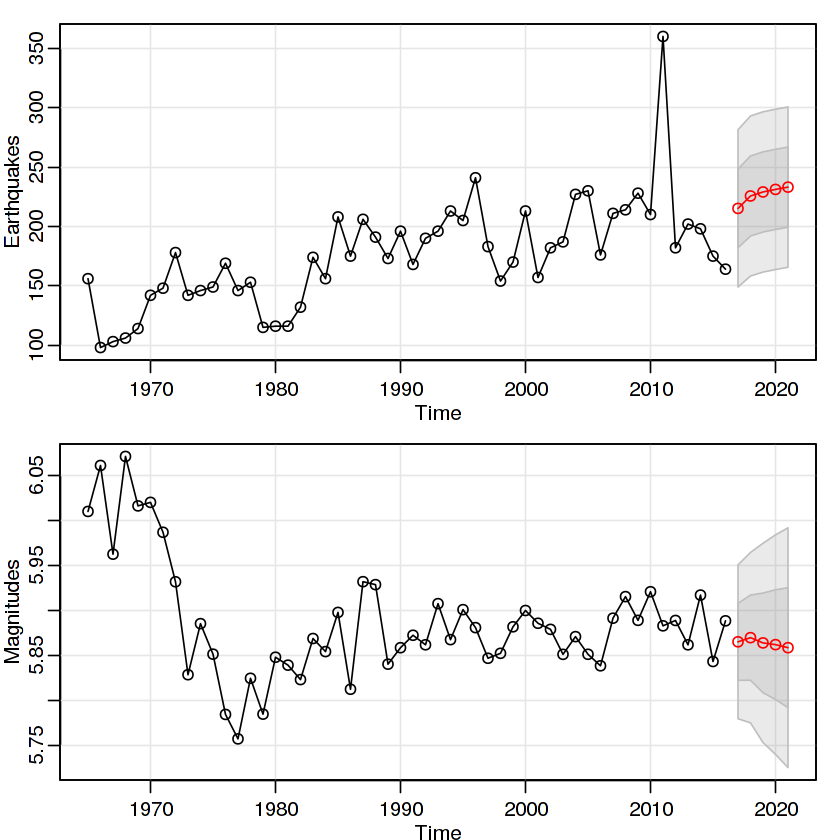

<h1>Global Earthquakes Analysis and Forecast</h1>

This simple analysis explores the frequency and intensity of the global earthquakes registred during 1965-2016 by the The National Earthquake Information Center. 

It is written in R, using the astsa package. The resulting forecast is the next:

However, there are many observations and additional information that you can find <a href="https://www.kaggle.com/zelzebu/significant-earthquakes-eda-series-forecast/">on the full explanation of the code.</a>
